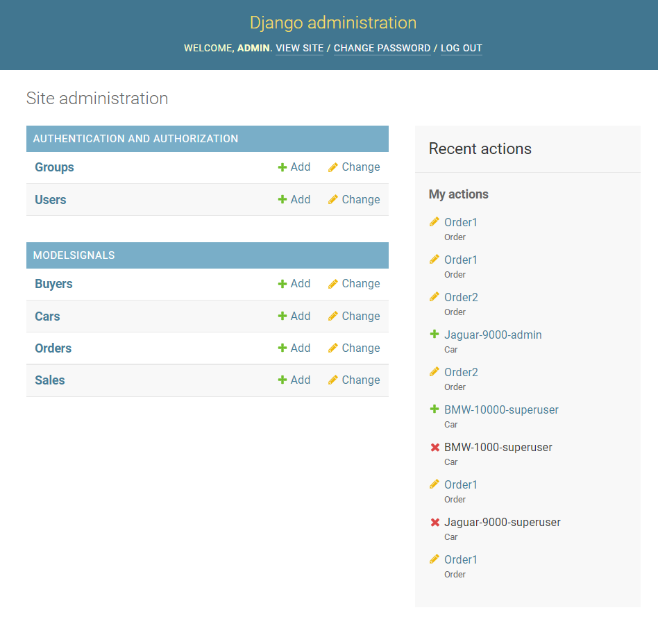

# Django-Signals


<!-- ABOUT THE PROJECT -->
## About The Project
<div align="center">
    
</div>


### Built With

* [Python](https://www.python.org/)
* [Django](https://www.djangoproject.com/start/overview/)


<!-- GETTING STARTED -->
## About Project

I made this project while learning signals. In this project I have used inbuilt modal signals and login logout signals of django.

### Prerequisites

Python == 3.8.8
Django == 3.2.5

### Installation

1. Clone the repo
   ```sh
   git clone https://github.com/prettyquail/Django-Signals.git
   ```
2. Login through admin panel of django
3. Whenever the signals are called, then you can see the changes accordingly, plus in the terminal too.

